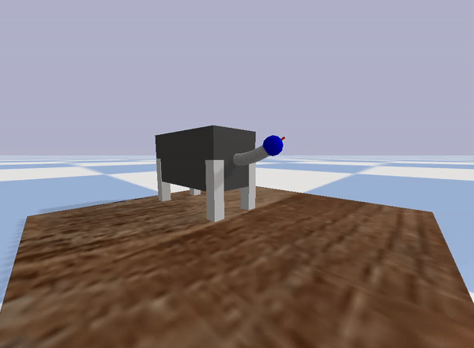

# Soft Robot Simulator


This work presents a novel cable-driven soft robot capable of flexing in 3D space with an additional degree of freedom for extension and retraction. In comparison with non-extensible soft robots, the proposed robot provides a larger workspace to reach 3D targeted points. We detail the robot design and prototyping, develop a novel mathematical model for predicting the robot's motion, and employ the model to control the robot that can autonomously follow time-varying trajectories.


# Installation and Setup

## Clone the Repository:

```
git clone https://github.com/MohammadKasaei/SimulatedFingerRobot.git
cd SoftRobotSimulator
```
## Set Up a Virtual Environment (optional):

```
python -m venv env
source env/bin/activate  # On Windows use `env\Scripts\activate`
```
## Install Dependencies:
Before running the script, make sure you have execute permissions. Run the following command:
```
chmod +x install_dependencies.sh
```
To install all the dependencies, simply run:
```
./install_dependencies.sh
```
Wait for the script to complete. Once done, all the required dependencies should be installed in your environment.


## Usage 
Instructions on how to run the code, experiments, and reproduce results.
```
python -m scripts.test_pybullet_PD
```
Once everything successfully installed, you'll see the simulated robot following a helictical square trajectory within the PyBullet simulator.




# License
This project is licensed under the MIT License.

# Acknowledgments
This work is supported by EU H2020 project Enhancing Healthcare with Assistive Robotic Mobile Manipulation (HARMONY, 101017008) and the Medical Research Council [MR/T023252/1].

